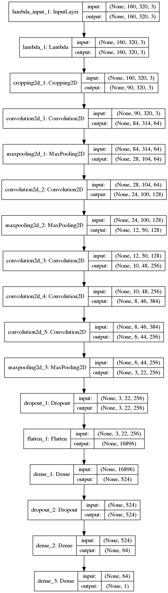
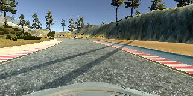
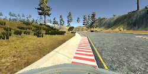
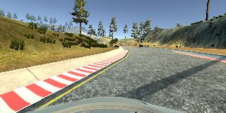
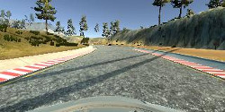
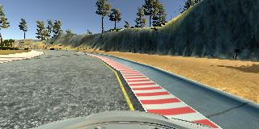
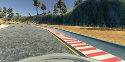
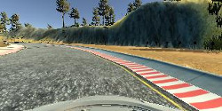
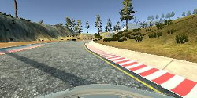
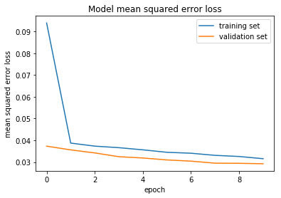

# **Behavioral Cloning** 


---

**Behavioral Cloning Project**

The goals / steps of this project are the following:
* Use the simulator to collect data of good driving behavior
* Build, a convolution neural network in Keras that predicts steering angles from images
* Train and validate the model with a training and validation set
* Test that the model successfully drives around track one without leaving the road
* Summarize the results with a written report


[//]: # (Image References)

[image1]: ./examples/placeholder.png "Model Visualization"
[image2]: ./examples/placeholder.png "Grayscaling"
[image3]: ./examples/placeholder_small.png "Recovery Image"
[image4]: ./examples/placeholder_small.png "Recovery Image"
[image5]: ./examples/placeholder_small.png "Recovery Image"
[image6]: ./examples/placeholder_small.png "Normal Image"
[image7]: ./examples/placeholder_small.png "Flipped Image"

## Rubric Points
### Here I will consider the [rubric points](https://review.udacity.com/#!/rubrics/432/view) individually and describe how I addressed each point in my implementation.  

Here is the link to my [python notebook code](http://localhost:8888/notebooks/CarND-Behavioral-Cloning-P3/model.ipynb) from where model.py code is derived.
---
### Files Submitted & Code Quality

#### 1. Submission includes all required files and can be used to run the simulator in autonomous mode

My project includes the following files:
* model.py containing the script to create and train the model
* drive.py for driving the car in autonomous mode
* model.h5 containing a trained convolution neural network 
* writeup_report.md or writeup_report.pdf summarizing the results

#### 2. Submission includes functional code
Using the Udacity provided simulator and my drive.py file, the car can be driven autonomously around the track by executing 
```sh
python drive.py model.h5
```

#### 3. Submission code is usable and readable

The model.py file contains the code for training and saving the convolution neural network. The file shows the pipeline I used for training and validating the model, and it contains comments to explain how the code works.

### Model Architecture and Training Strategy

#### 1. An appropriate model architecture has been employed

My model consists of a convolution neural network with 7x7, 5x5, and 3x3 filter sizes and depths between 64 and 524 (model.py lines 153 - 189) 

The model includes RELU layers to introduce nonlinearity (model.py lines 153-189), and the data is normalized in the model using a Keras lambda layer (model.py line 142). 

#### 2. Attempts to reduce overfitting in the model

The model contains maxpoool and dropout layers in order to reduce overfitting (model.py lines 172, 194,195, and 208). 

The model was trained and validated on different data sets to ensure that the model was not overfitting (code line 234). The model was tested by running it through the simulator and ensuring that the vehicle could stay on the track.

#### 3. Model parameter tuning

The model used an adam optimizer, so the learning rate was not tuned manually (model.py line 230).

#### 4. Appropriate training data

Training data was chosen to keep the vehicle driving on the road. I used a combination of center lane driving, recovering from the left and right sides of the road, driving in reverse direction. 

For details about how I created the training data, see the next section. 

### Model Architecture and Training Strategy

#### 1. Solution Design Approach

The overall strategy for deriving a model architecture was to use convolutions to find the features inside the images and thru them find a pattern that maps to a corresponding steering angle 

My first step was to use a convolution neural network model similar to LeNet [Keras LeNet](https://github.com/fchollet/keras/blob/master/examples/mnist_cnn.py)  I thought this model might be appropriate because it is dealing with the images as input.

I've trained this model with two rounds of track 1 data. The mse for both training and validation was not that bad (about 0.3) but when it is tested in autonomous mode In my opinion the training and validation errors didn't follow the normal pattern of training error is always less than validation error. In this case since the loss function is MSE and the validation and training data is composed of track 1 data multiple times - validation data may not be unique and could be similar data as in training set. However this model failed at the turns. I thought it could be due to two reasons. The number of convolution (32) and the convolution sizes (3x3) are small in number and the layers are less in number. At the same time the input image size is about 320x90. For this reason I've modified the model to have more convolution layers and the model is similar to AlexNet, but the conv sizes and the number of kernels are little different from the AlexNet model.

In order to gauge how well the model was working, I split my image and steering angle data into a training (80%) and validation set (20%). I found that my first model had a high mean squared error on the training and also failing to complete traversing the track 1.   

To combat the overfitting, I modified the model so that it has couple of Dropout layers one after the convolution layers and one after the fully connected layer.

The final step was to run the simulator to see how well the car was driving around track one. There were a few spots where the vehicle fell off the track (at turns, at places where there is no guards on the track and plain grass on the surface, soon after the bridge). To improve the driving behavior in these cases, the training data is increased by adding more training data at places where the driving failed when tested in autonomous mode.

Then I trained the modfied model with 'sgd' and 'adam' optimizer and stick with 'adam' optimizer as the mse is smaller and converges much faster. I trained the model at 5 and 10 epochs and decided to use 10 ecpochs as this resulted in lower mse for both validation and training as well as better sucess with the autonomous driving.

At the end of the process, the vehicle is able to drive autonomously around the track without leaving the road.

#### 2. Final Model Architecture

The final model architecture (model.py lines 136-218) consisted of a convolution neural network with the following layers and layer sizes

| Layer         		|     Description	        					| 
|:---------------------:|:---------------------------------------------:| 
| Input         		| 160x320x3 RGB image   							| 
| Normalization lambda     	| outputs 160x320x3 	|
| Crop2D lambda     	| outputs 90x320x3 	|
| Convolution 7x7     	| 1x1 stride, VALID padding, outputs 84x314x64 	|
| RELU					|												|
| Max pooling	      	| 3x3 stride,  outputs 28x104x64 				|
| Convolution 5x5     	| 1x1 stride, VALID padding, outputs 24x100x128 	|
| RELU					|												|
| Max pooling	      	| 2x2 stride,  outputs 12x50x128 				|
| Convolution 3x3     	| 1x1 stride, VALID padding, outputs 10x48x256 	|
| RELU					|												|
| Convolution 3x3     	| 1x1 stride, VALID padding, outputs 8x46x384 	|
| RELU					|												|
| Convolution 3x3     	| 1x1 stride, VALID padding, outputs 6x44x256 	|
| RELU					|												|
| Max pooling	      	| 2x2 stride,  outputs 3x22x256 				|
| Dropout					| dropout= 0.5												|
| Flatten					| 1x16896												|
| Fully connected	|   outputs 1x524					|
| Dropout					| dropout= 0.5												|
| Fully connected	|   outputs 1x64					|
| Softmax				| outputs 1x1        												|

Here is a visualization of the architecture (note: visualizing the architecture is optional according to the project rubric)



#### 3. Creation of the Training Set & Training Process

To capture good driving behavior, I first recorded two laps on track one using center lane driving. Here is an example image of center lane driving:



My initial training set didn't resulted in a model that succeeded in completing the track for one loop without failures. The driving is failing at certain places (such as some curves, before and after the bridge). For this reason I've recorded more short training sessions for that strech where it caused failures. Training with this data improved the performance of the model and got better during the driving (not going out of the road)

I then recorded the vehicle recovering from the left side and right sides of the road back to center so that the vehicle would learn to recover from the edges to the middle of the road. These images show what a recovery looks like starting from way left to recover to the middle of the road in the first row and similar steps for recover from right in the second row :










Then I repeated this process on track two in order to get more data points. However this resulted in having issues with the original track driving and cause

To augment the data set, I also flipped images for the left and right cameras and its corresponding steering angles thinking that this would increase the training set for the drving on a lane that is a mirror of the current track. This will improve the data set for trining without having to record another track. For example, here is an image that has then been flipped:





After the collection process, I had 67080 number of data points (images, and its corresponding angles). I then preprocessed this data by a Lambda function that converts the range of pixel values from -0.5 to 0.5 (range of 1)


I finally randomly shuffled the data set and put 20% of the data into a validation set. 

I used this training data for training the model. The validation set helped determine if the model was over or under fitting. The ideal number of epochs was 10 as evidenced by the following loss curve where the change in validation loss is getting smaller. 

I used an adam optimizer so that manually training the learning rate wasn't necessary. I also experimented with sgd optimizer and didn't see any improvements compared to using adam optimizer.

### My Reflections
#### I spent most of my time for this project on the following
- Modifying and playing with the model (specifically the convoultion size, and the number of convolutions)
- Adding different sets of training data (of those 10 sets that I recorded, I've used only 5 at the end)
- Training the model and testing with the above mentioned combinations
- Adding track 2 training data to the existing training data to see how the modified model performs on both track1 and track 2

#### Here are my observations after the end of this training activity:
- Generating/gathering right traning data takes big amount of time.
- Creating a model that fits the requirement is also takes big chunk of the time.
- Training a model with the above combination multiple times is much complex task than I've imagined.
- However I've learned a lot with the image augmentation techniques during this and last project (Traffic sign detection), how to chose a righ batch size, and most of all how to construct a network topology from scratch and look at the memory requirements/constraints during the model design.
    
#### What can be done if I have mode time from my side:
- Try to generate good amount of training data on track 2, and see if the model will work on track 2 and as well as track 1.
- Play with different topologies for the model design.
- Pay more attention to the correction factor that is used to determine the left and right steering angle from the center steering angle.

